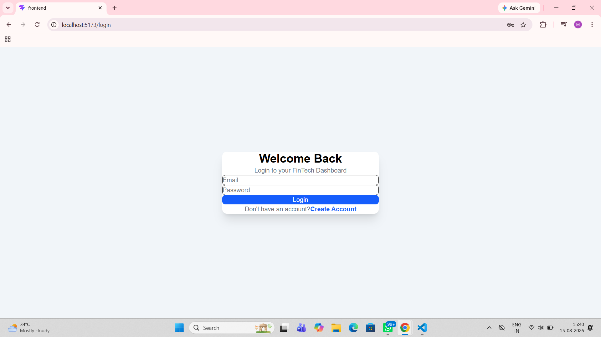
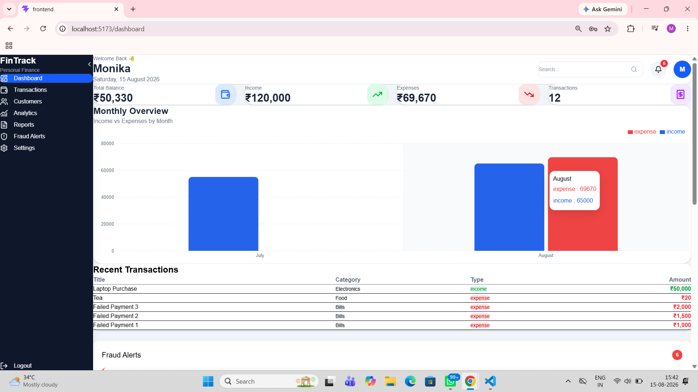
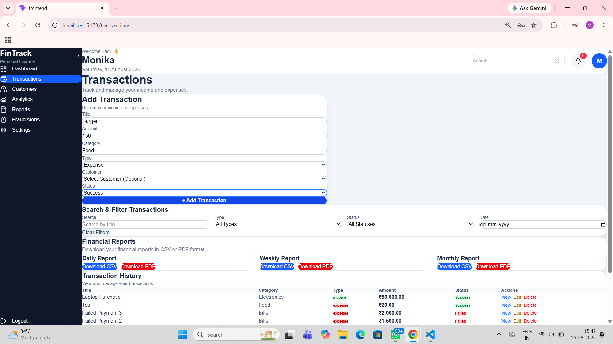
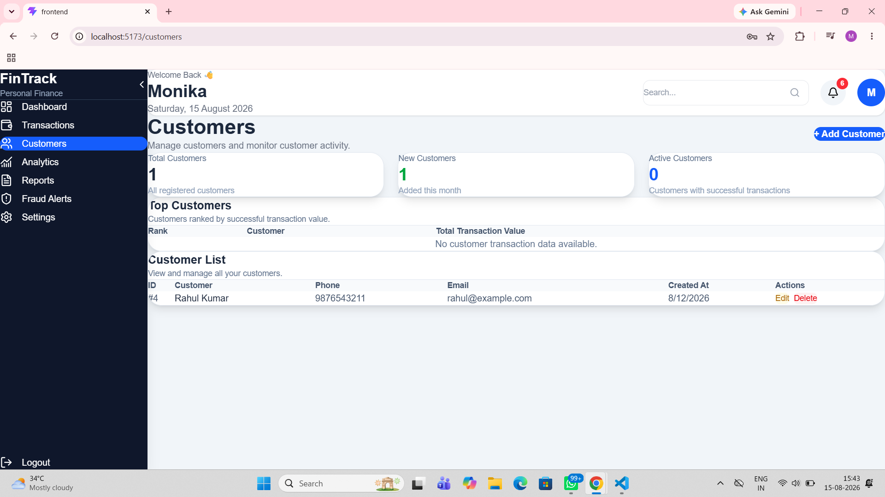
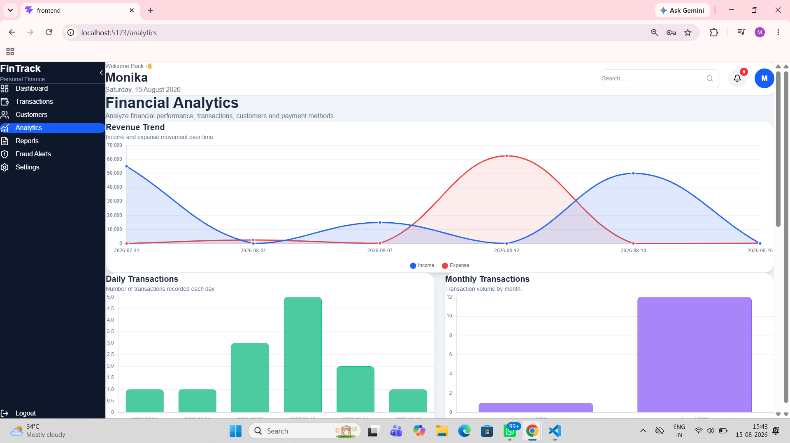
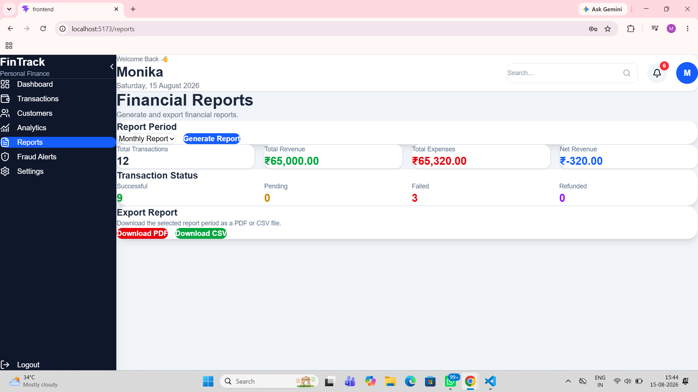
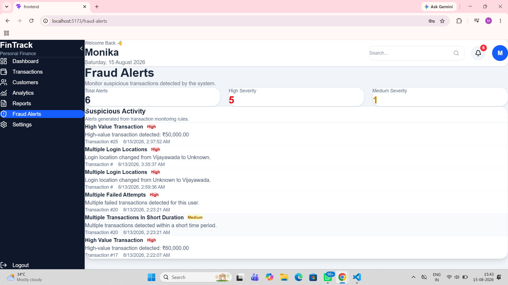
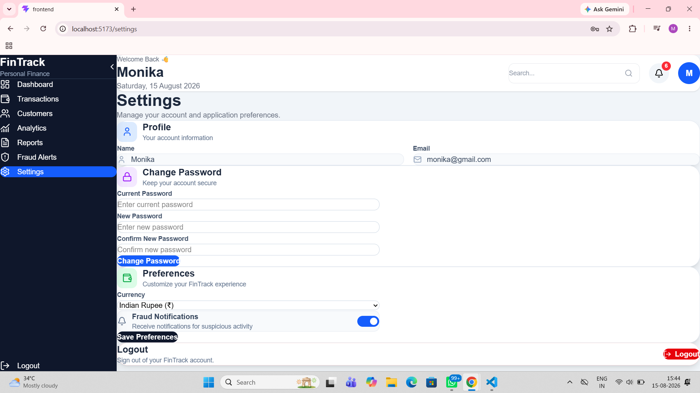

# FinTrack – Personal Finance & Financial Analytics Dashboard

## TalentBrainy Industrial Training Project

**Project Category:** Full Stack Web Application
**Project Type:** Industry Simulation Project
**Duration:** 4 Weeks

**Submitted By:**
**Monika Aishwarya Vegesna**

**Program:**
B.Tech – Computer Science (AI & Data Science)

---

# 1. Project Overview

FinTrack is a full-stack personal finance and financial analytics dashboard developed as part of the TalentBrainy Industrial Training Project.

The application provides a centralized platform for managing financial transactions, monitoring income and expenses, analyzing financial activity, managing customers, detecting potentially fraudulent activities, and generating financial reports.

The system follows a full-stack architecture consisting of a React-based frontend, Flask-based backend REST APIs, and a MySQL database. JWT-based authentication is used to protect user-specific resources and ensure that users can access only their authorized data.

The application also incorporates Redis/Memurai caching for frequently accessed dashboard information. Financial analytics are presented through interactive charts, while reporting functionality allows users to generate daily, weekly, and monthly reports and export financial information in CSV and PDF formats.

The project was developed with an emphasis on modular architecture, reusable components, secure API access, database relationships, responsive user interface design, and practical fintech application requirements.

---

# 2. Problem Statement

Modern financial applications process a large amount of transaction and customer information. Without a centralized financial dashboard, it can become difficult to monitor transactions, track financial performance, analyze customer activity, identify potentially fraudulent behavior, and generate useful financial reports.

The objective of FinTrack is to provide a centralized financial analytics platform that addresses these requirements through a web-based dashboard.

The application allows authenticated users to:

* Manage financial transactions.
* Monitor income and expenses.
* Search and filter transaction information.
* Manage customer information.
* Analyze financial activity through interactive visualizations.
* Detect potentially suspicious transactions using predefined rules.
* Monitor fraud alerts.
* Generate financial reports.
* Export reports in CSV and PDF formats.

The project simulates a real-world fintech application where security, data management, analytics, and usability are important requirements.

---

# 3. Project Objectives

The primary objectives of the FinTrack project are:

1. Develop a full-stack financial analytics web application.
2. Implement secure user registration and login.
3. Protect backend resources using JWT authentication.
4. Provide user-specific access to financial information.
5. Implement transaction management using REST APIs.
6. Establish relationships between users, customers, transactions, and fraud alerts.
7. Provide financial dashboard metrics.
8. Develop financial analytics and interactive visualizations.
9. Implement rule-based fraud detection.
10. Provide fraud alert monitoring.
11. Implement customer management functionality.
12. Generate daily, weekly, and monthly financial reports.
13. Provide CSV and PDF report exports.
14. Use Redis/Memurai caching for frequently accessed dashboard data.
15. Maintain a responsive and modular frontend.
16. Follow clean project organization and reusable component practices.

---

# 4. Technology Stack

## 4.1 Frontend

The frontend of FinTrack is developed using:

* React.js
* Vite
* JavaScript
* Axios
* React Router
* Tailwind CSS
* Recharts

React is used to build reusable user interface components and application pages.

Vite is used as the frontend development and build tool.

Axios is used for communication between the frontend and backend REST APIs.

React Router is used for application navigation.

Tailwind CSS is used for responsive and modern user interface styling.

Recharts is used to display interactive financial analytics and visualization components.

---

## 4.2 Backend

The backend is developed using:

* Python
* Flask
* Flask REST APIs
* Flask-JWT-Extended
* Flask-SQLAlchemy
* Flask-CORS
* ReportLab

Flask provides the backend REST API framework.

Flask-JWT-Extended provides JWT-based authentication and protection for API endpoints.

Flask-SQLAlchemy is used for database interaction through the SQLAlchemy ORM.

Flask-CORS enables communication between the React frontend and Flask backend.

ReportLab is used to generate PDF financial reports.

---

## 4.3 Database

The application uses:

* MySQL
* SQLAlchemy ORM

MySQL stores user, customer, transaction, and fraud alert information.

SQLAlchemy provides an ORM-based approach for interacting with the database.

---

## 4.4 Caching

Redis/Memurai is used for caching frequently accessed dashboard information.

Dashboard summary data is cached for a limited period to reduce repeated database queries.

---

## 4.5 Development Tools

* Git
* GitHub
* Visual Studio Code
* MySQL
* Node.js
* npm
* Python virtual environment

---

# 5. System Architecture

FinTrack follows a full-stack architecture.

```text
                    User
                     |
                     v
             React Frontend
                     |
                     v
              Axios API Calls
                     |
                     v
              Flask REST APIs
                     |
          +----------+----------+
          |                     |
          v                     v
     SQLAlchemy ORM        Redis/Memurai
          |                     |
          v                     |
      MySQL Database <----------+
```

The frontend communicates with the Flask backend through REST APIs.

The Flask backend processes requests, performs authentication and authorization checks, executes business logic, communicates with MySQL through SQLAlchemy, and uses Redis/Memurai for selected cached information.

---

# 6. Backend Architecture

The backend follows a layered architecture:

```text
Routes
   ↓
Controllers
   ↓
Services
   ↓
Models
   ↓
Database
```

## 6.1 Routes

Routes define the available REST API endpoints and connect incoming requests to the appropriate controller functions.

The project contains routes for:

* Authentication
* Dashboard
* Transactions
* Customers
* Analytics
* Fraud Alerts
* Reports

---

## 6.2 Controllers

Controllers handle:

* HTTP requests
* Authentication checks
* Input processing
* Database operations
* Business logic coordination
* API responses

---

## 6.3 Services

Services contain reusable business logic.

The fraud detection service is responsible for checking transactions against predefined fraud detection rules.

---

## 6.4 Models

SQLAlchemy models define the database structure and relationships.

Major models include:

* User
* Customer
* Transaction
* FraudAlert

---

# 7. Authentication and Security

FinTrack implements authentication to protect user-specific resources.

The authentication flow includes:

1. User registration.
2. Password hashing before storing credentials.
3. User login using email and password.
4. Password verification during login.
5. JWT token generation after successful authentication.
6. JWT-protected backend endpoints.
7. JWT token attachment to protected API requests.
8. User-specific access to transactions, customers, analytics, reports, and fraud alerts.

Passwords are not stored as plain text. Password hashing is implemented using Werkzeug security utilities.

JWT authentication is implemented using Flask-JWT-Extended.

Protected endpoints use JWT verification to identify the authenticated user.

---

# 8. Dashboard Module

The dashboard provides a summary of the user's financial activity.

The dashboard calculates and displays:

* Total Income
* Total Expenses
* Total Revenue
* Current Balance
* Total Transactions
* Daily Revenue
* Monthly Revenue
* Active Customers
* Pending Transactions
* Failed Transactions
* Fraud Alerts
* Recent Transactions

The current balance is calculated using:

```text
Balance = Total Income - Total Expenses
```

Dashboard information is retrieved through protected backend APIs.

Frequently accessed dashboard summary information is cached using Redis/Memurai.

---

# 9. Transaction Management

The Transactions module allows users to manage their financial transactions.

The implemented operations include:

* Add transaction
* View transactions
* View individual transaction
* Update transaction
* Delete transaction
* Search transactions
* Filter transactions by type
* Filter transactions by status
* Filter transactions by date
* Paginate transactions

Each transaction can contain:

* Transaction ID
* User ID
* Customer ID
* Title
* Amount
* Transaction Type
* Category
* Payment Method
* Status
* Created At

Supported transaction statuses include:

* Success
* Pending
* Failed
* Refunded

Transactions are associated with the authenticated user.

Transactions can also be associated with customers through the `customer_id` relationship.

---

# 10. Customer Management

The Customer module provides functionality for managing customer information.

Customer records contain:

* Customer ID
* User ID
* Customer Name
* Phone
* Email
* Created At

The application provides REST API operations for:

* Adding customers
* Viewing customers
* Viewing individual customers
* Updating customers
* Deleting customers
* Customer analytics

Customers are associated with the authenticated user.

Transactions can reference a customer through the `customer_id` foreign key.

This allows the application to maintain a relationship between customer records and their financial transactions.

---

# 11. Financial Analytics

FinTrack provides financial analytics based on transaction data.

The implemented analytics include:

* Revenue Trend
* Daily Transactions
* Monthly Transactions
* Expense Analysis
* Customer Growth
* Payment Method Distribution
* Category-wise Expense Summary
* Monthly Income Summary
* Monthly Expense Summary

The analytics APIs process transaction and customer information from the database and return structured data to the React frontend.

The frontend uses interactive chart components to visualize the returned financial information.

---

# 12. Fraud Detection

FinTrack implements rule-based fraud detection to identify potentially suspicious activity.

The implemented rules include:

## 12.1 High-Value Transactions

Transactions with an amount of ₹50,000 or more generate a high-severity fraud alert.

Example:

```text
High-value transaction detected: ₹60,000.00
```

---

## 12.2 Multiple Failed Attempts

Multiple failed transactions for the same user can generate a high-severity fraud alert.

Example:

```text
Multiple failed transactions detected for this user.
```

---

## 12.3 Multiple Transactions in a Short Duration

Multiple transactions occurring within a short time period can generate a medium-severity fraud alert.

Example:

```text
Multiple transactions detected within a short time period.
```

---

## 12.4 Multiple Login Locations

The application tracks the user's previous login location.

When the login location changes, a high-severity fraud alert can be generated.

Example:

```text
Login location changed from Hyderabad to Vijayawada.
```

The system stores the previous login location in the user record.

---

# 13. Fraud Alert Management

Detected suspicious activities are stored in the `fraud_alerts` table.

Each fraud alert contains:

* Alert ID
* User ID
* Transaction ID, when applicable
* Alert Type
* Severity
* Message
* Created At

The application provides APIs for retrieving fraud alerts.

Fraud alerts are restricted to the authenticated user's data.

When a transaction associated with a fraud alert is deleted, the related fraud alerts are also removed to maintain database consistency.

---

# 14. Redis/Memurai Caching

Redis/Memurai is used to cache frequently accessed dashboard information.

The dashboard summary uses a user-specific cache key:

```text
dashboard_summary:{user_id}
```

When the dashboard summary is requested:

1. The backend checks Redis.
2. If cached data exists, it is returned directly.
3. If cached data does not exist, the backend calculates the dashboard summary from MySQL.
4. The result is stored in Redis.
5. The cached result is returned to the frontend.

The dashboard summary cache is configured with a limited expiration period.

When transactions are added, updated, or deleted, the corresponding dashboard cache is invalidated so that subsequent requests retrieve updated information.

This reduces unnecessary database queries for frequently accessed dashboard information.

---

# 15. Financial Reports

FinTrack provides financial reporting functionality for different time periods.

Supported reports include:

* Daily Report
* Weekly Report
* Monthly Report

Reports contain financial summary information such as:

* Total Transactions
* Total Revenue
* Total Expenses
* Net Revenue
* Successful Transactions
* Pending Transactions
* Failed Transactions
* Refunded Transactions

The backend provides separate endpoints for generating reports for each supported period.

---

# 16. CSV Export

The application supports CSV export of financial transaction information.

The exported data can include:

* Transaction ID
* Title
* Amount
* Type
* Category
* Payment Method
* Status
* Created At

CSV reports are available through the report export API.

---

# 17. PDF Export

FinTrack also supports PDF report generation using ReportLab.

The PDF report contains financial summary information and transaction details.

The financial summary can include:

* Total Transactions
* Total Revenue
* Total Expenses
* Net Revenue
* Successful Transactions
* Pending Transactions
* Failed Transactions
* Refunded Transactions

Transaction details can include:

* Transaction ID
* Title
* Amount
* Type
* Category
* Status

PDF reports are available for daily, weekly, and monthly reporting periods.

---

# 18. Database Design

FinTrack uses MySQL as the primary database.

The major database tables are:

```text
users
customers
transactions
fraud_alerts
```

## 18.1 Users Table

The `users` table stores authentication and user profile information.

Important fields include:

* id
* name
* email
* password
* last_login_location
* created_at

---

## 18.2 Customers Table

The `customers` table stores customer information.

Important fields include:

* id
* user_id
* customer_name
* phone
* email
* created_at

The `user_id` field associates a customer with the authenticated user.

---

## 18.3 Transactions Table

The `transactions` table stores financial transaction information.

Important fields include:

* id
* user_id
* customer_id
* title
* amount
* type
* category
* payment_method
* status
* created_at

The `user_id` associates the transaction with the user.

The `customer_id` optionally associates the transaction with a customer.

---

## 18.4 Fraud Alerts Table

The `fraud_alerts` table stores suspicious activity detected by the fraud detection system.

Important fields include:

* id
* user_id
* transaction_id
* alert_type
* severity
* message
* created_at

---

# 19. Database Relationships

The main relationships are:

```text
User
 |
 +---- Customers
 |
 +---- Transactions
 |
 +---- Fraud Alerts

Customer
 |
 +---- Transactions

Transaction
 |
 +---- Fraud Alerts
```

A user can have multiple customers.

A user can have multiple transactions.

A customer can be associated with multiple transactions.

A transaction can have associated fraud alerts.

The `customer_id` field in the transaction table is nullable, allowing transactions to exist without an associated customer.

---

# 20. REST API Architecture

The backend exposes REST APIs for the major application modules.

## Authentication APIs

```text
POST /register
POST /login
```

## Dashboard APIs

```text
GET /summary
GET /category-summary
GET /monthly-summary
GET /recent-transactions
```

## Transaction APIs

```text
POST   /
GET    /
GET    /<id>
PUT    /<id>
DELETE /<id>
```

## Customer APIs

```text
POST   /
GET    /
GET    /<id>
PUT    /<id>
DELETE /<id>
GET    /analytics
```

## Analytics APIs

```text
GET /revenue-trend
GET /daily-transactions
GET /monthly-transactions
GET /expense-analysis
GET /customer-growth
GET /payment-method-distribution
```

## Fraud APIs

```text
GET /alerts
GET /alerts/<id>
```

## Report APIs

```text
GET /daily
GET /weekly
GET /monthly
GET /export/csv
GET /export/pdf
```

Protected APIs require valid JWT authentication.

Detailed endpoint information is maintained separately in:

```text
docs/API_DOCUMENTATION.md
```

---

# 21. Frontend Architecture

The frontend is implemented using React and organized into reusable components and pages.

Major frontend areas include:

* Authentication
* Dashboard
* Transactions
* Customers
* Analytics
* Fraud Alerts
* Reports
* Settings
* Common UI components
* Transaction components
* Analytics components

The React application uses reusable components to reduce duplication and maintain consistent UI behavior.

Axios is used to communicate with backend REST APIs.

React Router is used for navigation between application pages.

---

# 22. User Interface

The application provides a modern responsive dashboard interface.

The major pages include:

* Login
* Dashboard
* Transactions
* Customers
* Analytics
* Fraud Alerts
* Reports
* Settings

The interface provides users with dedicated sections for financial management, analytics, customer management, fraud monitoring, and reporting.

The transaction interface supports searching, filtering, pagination, and transaction management.

The analytics interface presents financial information using interactive visualizations.

---

# 23. Testing

The implemented functionality was manually tested during development.

The following areas were tested:

* User registration
* User login
* JWT-protected endpoints
* Transaction creation
* Transaction retrieval
* Transaction search
* Transaction filtering
* Transaction pagination
* Transaction update
* Transaction deletion
* Customer creation
* Customer retrieval
* Customer update
* Customer deletion
* Customer-transaction association
* Dashboard calculations
* Financial analytics
* Fraud detection rules
* Fraud alert retrieval
* Redis dashboard caching
* Cache invalidation after transaction changes
* Daily reports
* Weekly reports
* Monthly reports
* CSV export
* PDF export
* Frontend navigation
* API integration

The core application functionality was tested successfully during development.

---

# 24. Challenges and Solutions

## 24.1 Database Configuration

A relational database was required for the project. MySQL was configured as the database system and integrated with Flask using SQLAlchemy.

## 24.2 Frontend and Backend Integration

The React frontend needed to communicate securely with the Flask backend.

Axios was used as the centralized HTTP client and Flask-CORS was configured to allow communication between the frontend and backend.

## 24.3 Authentication

Protected resources required user-specific access.

JWT-based authentication was implemented to identify authenticated users and protect backend endpoints.

## 24.4 Dashboard Performance

Dashboard calculations could result in repeated database queries.

Redis/Memurai caching was implemented for dashboard summary information to reduce repeated queries.

## 24.5 Fraud Detection

Fraud detection needed to identify multiple types of suspicious behavior.

A rule-based fraud service was implemented to evaluate transactions and generate appropriate fraud alerts.

## 24.6 Maintaining Data Consistency

Transactions and fraud alerts are related.

When a transaction is deleted, its associated fraud alerts are also deleted to prevent orphaned fraud alert records.

---

# 25. Project Folder Structure

The project follows a modular full-stack structure.

```text
fintech-dashboard/
│
├── backend/
│   ├── app/
│   │   ├── controllers/
│   │   ├── models/
│   │   ├── routes/
│   │   ├── services/
│   │   └── ...
│   │
│   └── ...
│
├── frontend/
│   ├── src/
│   │   ├── components/
│   │   ├── pages/
│   │   ├── services/
│   │   ├── context/
│   │   └── App.jsx
│   │
│   └── ...
│
├── database/
│   └── fintech_dashboard.sql
│
├── docs/
│   ├── API_DOCUMENTATION.md
│   └── PROJECT_REPORT.md
│
├── README.md
└── ...
```

---

# 26. Screenshots

The following screenshots demonstrate the major modules and user interface of the FinTrack application.

## 26.1 Login Page

The login page allows registered users to securely authenticate and access protected application features.



---

## 26.2 Dashboard

The dashboard provides an overview of financial activity, including income, expenses, balance, transaction counts, customer information, and fraud alerts.



---

## 26.3 Transactions Page

The Transactions page allows users to view, search, filter, paginate, add, update, and delete financial transactions.


---

## 26.4 Add Transaction

The transaction form allows users to record financial transactions with information such as title, amount, category, transaction type, status, and customer association.



---

## 26.5 Customers Page

The Customers page provides customer management functionality and allows customer information to be associated with financial transactions.



---

## 26.6 Analytics Page

The Analytics page provides interactive financial visualizations for revenue, transactions, expenses, customer growth, and payment methods.



---

## 26.7 Reports Page

The Reports page provides daily, weekly, and monthly financial reporting along with CSV and PDF export functionality.



---

## 26.8 Fraud Alerts

The Fraud Alerts page displays potentially suspicious activities detected by the rule-based fraud detection system.



---

## 26.9 Settings Page

The Settings page provides the available application and user configuration options.



---

# 27. Assignment Deliverables

The project provides the major deliverables specified in the TalentBrainy assignment.

| Deliverable          | Status         |
| -------------------- | -------------- |
| Complete Source Code | Completed      |
| GitHub Repository    | Completed      |
| Database Script      | Completed      |
| API Documentation    | Completed      |
| Project README       | Completed      |
| Project Report       | In Progress    |
| Screenshots          | To be added    |
| Demo Video           | To be prepared |

The database script is available at:

```text
database/fintech_dashboard.sql
```

The API documentation is available at:

```text
docs/API_DOCUMENTATION.md
```

---

# 28. Future Enhancements

Potential future improvements include:

* Advanced machine-learning-based fraud detection
* More advanced financial analytics
* Budget planning
* Spending prediction
* Additional report formats
* Improved notification systems
* More granular user roles and permissions
* Automated testing
* Cloud deployment
* Performance optimization

These are considered future enhancements and are not represented as currently implemented features.

---

# 29. Conclusion

FinTrack successfully demonstrates the development of a full-stack financial analytics dashboard based on the requirements of the TalentBrainy Industrial Training Project.

The application combines a React frontend, Flask REST APIs, MySQL database, JWT authentication, Redis/Memurai caching, financial analytics, customer management, rule-based fraud detection, and financial reporting.

The project demonstrates practical experience in frontend development, backend API development, database design, authentication, data visualization, caching, CRUD operations, and modular full-stack application architecture.

The completed application provides a foundation for a production-style fintech dashboard while also allowing future enhancements such as advanced fraud detection, predictive analytics, cloud deployment, and automated testing.

---

# 30. Author

**Monika Aishwarya Vegesna**

B.Tech – Computer Science (AI & Data Science)

TalentBrainy Industrial Training Project

---

# 31. Supporting Project Documentation

Additional project documentation is available in the repository:

* `README.md` – Project overview, features, architecture, setup, and technology stack.
* `database/fintech_dashboard.sql` – MySQL database creation script.
* `docs/API_DOCUMENTATION.md` – REST API documentation.
* `docs/PROJECT_REPORT.md` – This project report.
